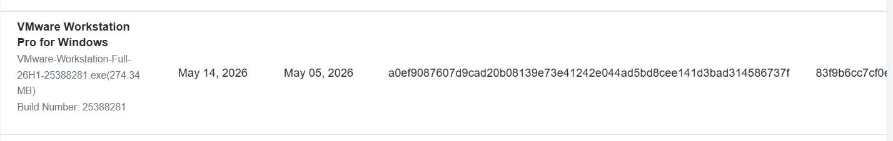
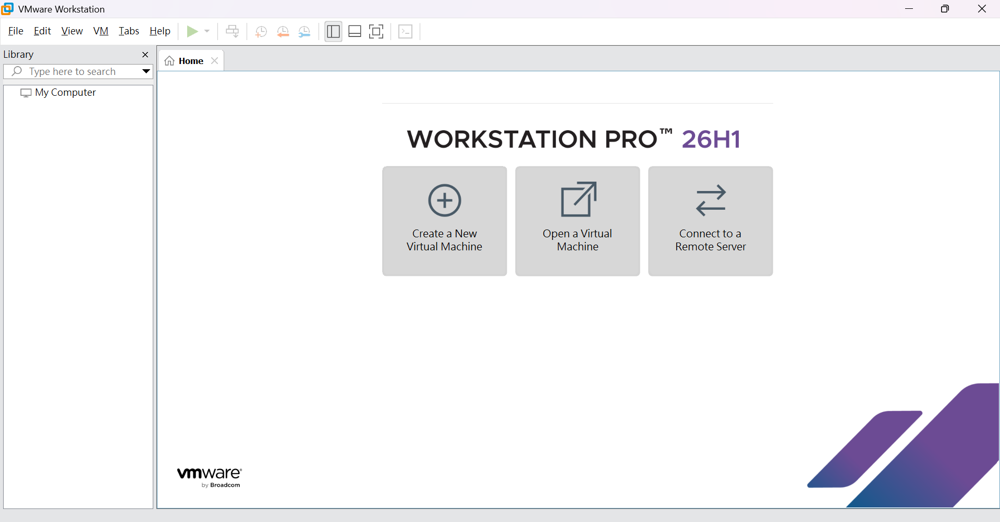

# Ubuntu_VM 建立

## 第一步：下載
**1.** 下載 VMware Workstation Pro，[下載連結](https://knowledge.broadcom.com/external/article/368667/download-and-license-vmware-desktop-hype.html?utm_source=chatgpt.com)，選擇Windows版本。 
**2.** Windows 詢問是否允許變更裝置時，按「是」。 
**3.** 進入安裝畫面後按 Next 就好。 
**4.** 勾選接受授權條款。 
**5.** 安裝位置維持預設即可。 

---

這是VMware的安裝檔： 

這是VMware安裝成功的畫面： 

---

## 第二步：下載Ubuntu
**1.** 先下載 Ubuntu 22.04 LTS Desktop ISO，[下載連結](https://ubuntu.com/download/desktop?utm_source=chatgpt.com)。  

這是下載好後的正確檔名：  

**2.** Create a New Virtual Machine 代表建立一台虛擬電腦(**選擇這個**)、Open a Virtual Machine 代表已經存在的虛擬電腦、Connect to a Remote Server 代表連到遠端VMware伺服器。 
**3.** 選擇 Typical (recommended)。  
**4.** 在 Installer disc image file (iso) 這個選項中找到剛剛下載的 ubuntu-22.04.5-desktop-amd64.iso 並選取。
