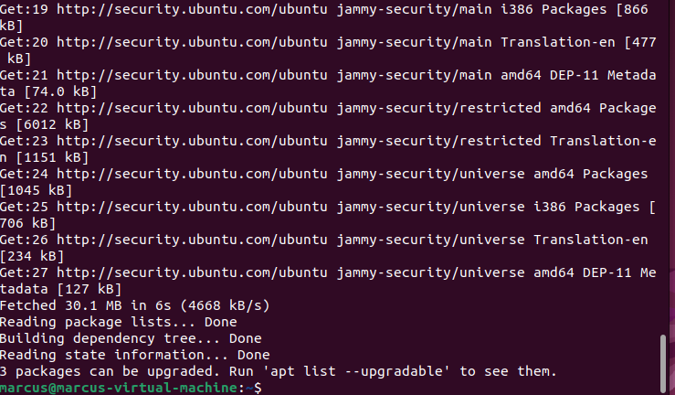
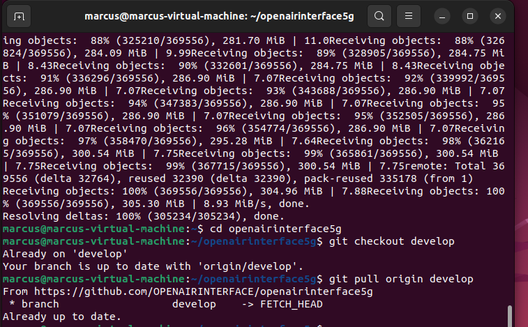
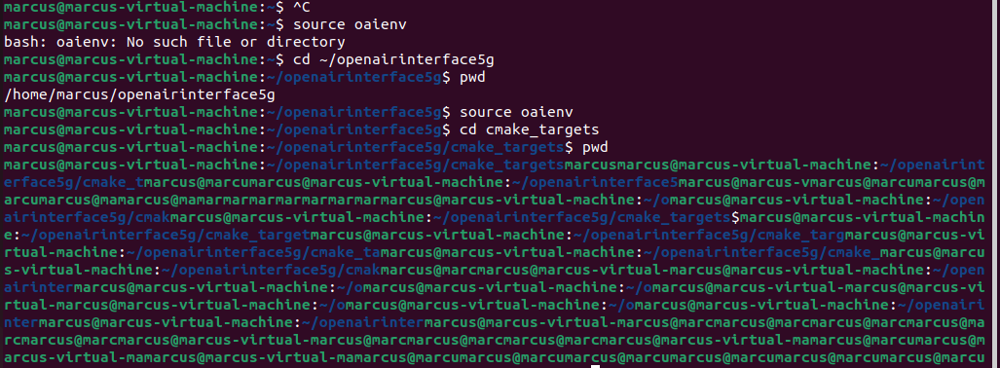
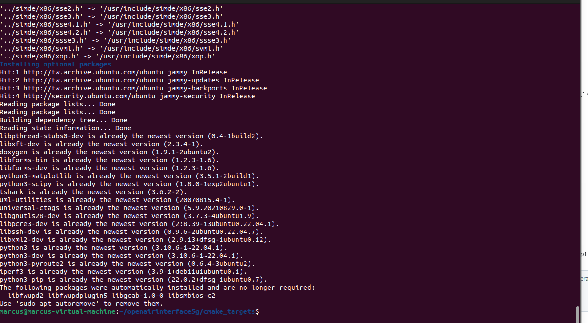
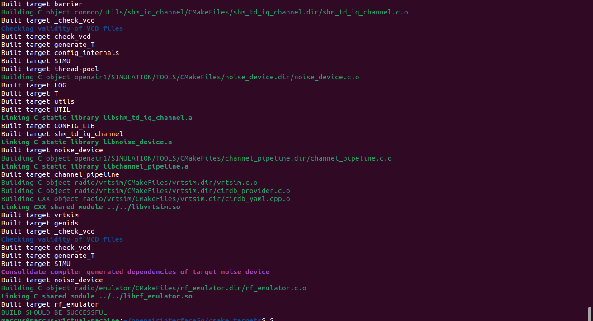
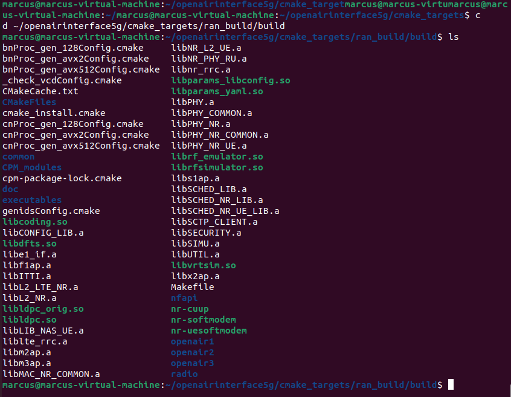

# OAI gNB (CU/DU 分離) 與 OAI NR-UE RF 模擬安裝筆記
詳細記錄我在建立此 OAI 的各項步驟以及使用的程式。

## 前置作業
建置 OAI 環境前需要一個 Ubuntu 環境。

---

## OAI環境建立紀錄

### 1.確認 Ubuntu 版本
在終端機輸入`lsb_release -a`確認版本是否正確。<br>

確定是 22.04.x LTS：
```bash
No LSB modules are available.
Distributor ID: Ubuntu
Description:    Ubuntu 22.04.5 LTS
Release:        22.04
Codename:       jammy
```

---

### 2.更新基本套件
在終端機輸入`sudo apt update`更新基本套件。<br> 

---

### 3.安裝 Git
在終端機輸入`sudo apt install -y git`，安裝完後輸入`git --version`，確定版本是否是`git version 2.34.1`。

---

### 4.Git 的 Clone 和 pull
**1.** 輸入`git clone https://github.com/OPENAIRINTERFACE/openairinterface5g.git`。<br>
**2.** 輸入 `cd openairinterface5g` ，並輸入 `pwd` 確認位置。<br>
**3.** 輸入`git checkout develop`。<br>
**4.** 輸入`git pull origin develop`。<br> 

---

### 5.建立 OAI 編譯環境
**1.** 輸入 `source oaienv` 。<br>
**2.** 進入建置目錄 `cd cmake_targets` ，輸入 pwd 確認。<br> 

**3.** 安裝所有依賴，輸入 `./build_oai -I --install-optional-packages` 安裝 gcc 、cmake 、 ASN1 Compiler 、 UHD 、 Wireshark 、 libsctp 、 library。 <br> 

---

### 6.編譯 gNB 與 NR-UE
**1.** 編譯 OAI 的 gNB 與 NR-UE，產生後續執行模擬所需的可執行檔，輸入 `./build_oai --gNB --nrUE` 。<br>
gNB 與 NR-UE 編譯成功：<br> 

**2.** 輸入 `cd ~/openairinterface5g/cmake_targets/ran_build/build` ，並輸入 `ls` 確認是否有 `nr-softmodem nr-uesoftmodem` 這兩行程式。<br>
結果：<br> 

---

### 7.啟動
**1.** 輸入以下程式，確定設定檔：

```bash
cd ~/openairinterface5g
find . -name "cu_gnb.conf"
find . -name "du_gnb.conf"
find . -name "ue.conf"
```
以下是結果：

```bash
./targets/PROJECTS/GENERIC-NR-5GC/CONF/cu_gnb.conf
./targets/PROJECTS/GENERIC-NR-5GC/CONF/du_gnb.conf
./targets/PROJECTS/GENERIC-NR-5GC/CONF/ue.conf
```

**2.** 輸入這個路徑 `cd cmake_targets/ran_build/build` 。<br>


