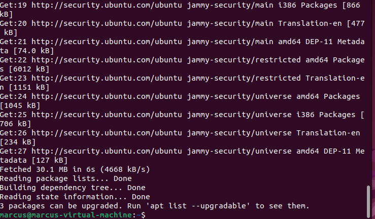
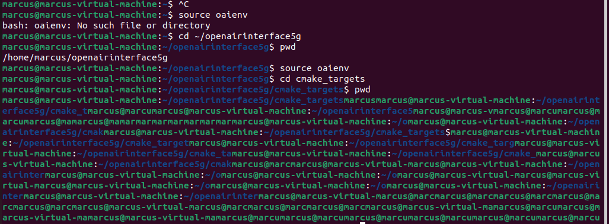
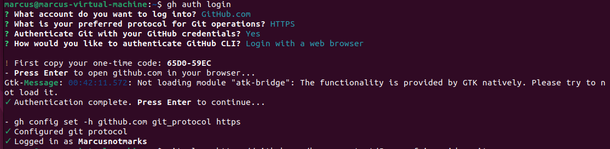
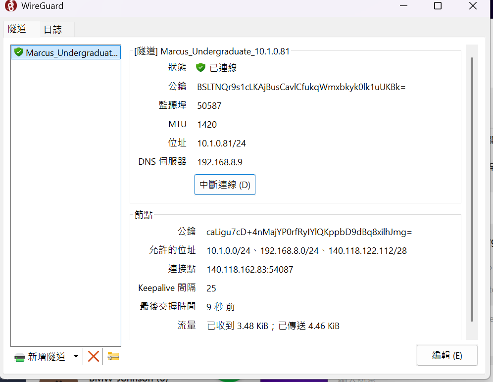
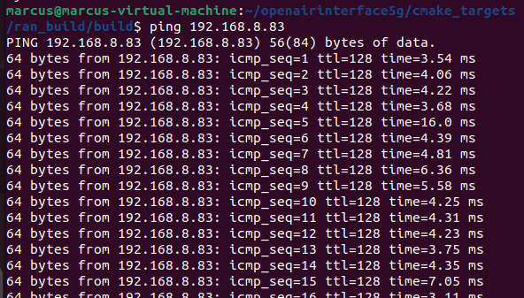

# OAI gNB (CU/DU 分離) 與 OAI NR-UE RF 模擬安裝筆記
詳細記錄我在建立此 OAI 的各項步驟以及使用的程式。

## 前置作業
建置 OAI 環境前需要一個 Ubuntu 環境。

---

## OAI環境建立紀錄

### 1.確認 Ubuntu 版本
在終端機輸入`lsb_release -a`確認版本是否正確。<br>

確定是 22.04.x LTS：
```bash
No LSB modules are available.
Distributor ID: Ubuntu
Description:    Ubuntu 22.04.5 LTS
Release:        22.04
Codename:       jammy
```

---

### 2.更新基本套件
在終端機輸入`sudo apt update`更新基本套件。<br> 

---

### 3.安裝 Git
在終端機輸入`sudo apt install -y git`，安裝完後輸入`git --version`，確定版本是否是`git version 2.34.1`。

---

### 4.Git 的 Clone 和 pull
**1.** 輸入`git clone https://github.com/OPENAIRINTERFACE/openairinterface5g.git`。<br>
**2.** 輸入 `cd openairinterface5g` ，並輸入 `pwd` 確認位置。<br>
**3.** 輸入`git checkout develop`。<br>
**4.** 輸入`git pull origin develop`。<br> 

---

### 5.建立 OAI 編譯環境
**1.** 輸入 `source oaienv` 。<br>
**2.** 進入建置目錄 `cd cmake_targets` ，輸入 pwd 確認。<br> 

**3.** 安裝所有依賴，輸入 `./build_oai -I --install-optional-packages` 安裝 gcc 、cmake 、 ASN1 Compiler 、 UHD 、 Wireshark 、 libsctp 、 library。 <br> 

---

### 6.編譯 gNB 與 NR-UE
**1.** 編譯 OAI 的 gNB 與 NR-UE，產生後續執行模擬所需的可執行檔，輸入 `./build_oai --gNB --nrUE` 。<br>
gNB 與 NR-UE 編譯成功：<br> 

**2.** 輸入 `cd ~/openairinterface5g/cmake_targets/ran_build/build` ，並輸入 `ls` 確認是否有 `nr-softmodem nr-uesoftmodem` 這兩行程式。<br>
結果：<br> 

**3.** 輸入以下程式，確定設定檔：

```bash
cd ~/openairinterface5g
find . -name "cu_gnb.conf"
find . -name "du_gnb.conf"
find . -name "ue.conf"
```
以下是結果：

```bash
./targets/PROJECTS/GENERIC-NR-5GC/CONF/cu_gnb.conf
./targets/PROJECTS/GENERIC-NR-5GC/CONF/du_gnb.conf
./targets/PROJECTS/GENERIC-NR-5GC/CONF/ue.conf
```

**4.** 輸入這個路徑 `cd cmake_targets/ran_build/build` ，接著輸入 `pwd` 以及 `ls` ，可以看到以下結果：<br> 

---

### 7.設定檔(CU/DU/UE)
**1.** 用 GitHub CLI 取得密碼，執行以下程式：<br>

```bash
sudo apt update
sudo apt install gh
```

**2.** 輸入 `gh auth login` 後會遇到 4 個問題，依序選擇 `GitHub.com` 、 `HTTPS` 、 `Yes` 、 `Login with a web browser` 會顯示8位密碼後 *65D0-59EC*，接著會跳轉到網頁版，繼續 GitHub 登入步驟，輸入剛剛取得的8位密碼候選 Authorize GitHub CLI 。<br> 


**3.** 輸入以下程式並 clone：

```bash
cd ~
git clone https://github.com/bmw-ece-ntust/5g-nr-rfsim-guides.git
```
 <br>
下載完後輸入 `ls ~/5g-nr-rfsim-guides/oai_gnb_oai_ue/config` 確認是否有檔案：

```bash
cu_gnb.conf
du_gnb.conf
ue.conf
```

**4.** 修改 `AMF連線設定` 以及 `GNB網路介面`，輸入：<br>

```bash
sed -i 's/192\.168\.8\.44/192.168.8.83/g' \
~/marcus/5g-nr-rfsim-guides/oai_gnb_oai_ue/config/cu_gnb.conf
```

**5.** 並輸入以下確認是否都更改ip位置成功：<br>
```bash
grep -n "192.168.8.83" ~/marcus/5g-nr-rfsim-guides/oai_gnb_oai_ue/config/cu_gnb.conf
grep -n "amf_ip_address" ~/marcus/5g-nr-rfsim-guides/oai_gnb_oai_ue/config/cu_gnb.conf
```
若出現則代表修改成功：
```bash
52: GNB_IPV4_ADDRESS_FOR_NG_AMF = "192.168.8.83";
53: GNB_IPV4_ADDRESS_FOR_NGU    = "192.168.8.83";
amf_ip_address = ({ ipv4 = "192.168.8.108"; });
```

---

### 8.啟動與執行(CU)
**1.** 在終端機開啟三個不同的畫面，並輸入路徑： `cd ~/openairinterface5g/cmake_targets/ran_build/build` 。<br>

**2.** 啟動 CU 並載入對應的 CU 設定檔 `sudo ./nr-softmodem --rfsim -O /home/marcus/5g-nr-rfsim-guides/oai_gnb_oai_ue/config/cu_gnb.conf` 。<br>
以下是CU成功啟動：<br>   

**3.** 啟動 DU 並載入對應的 DU 設定檔 `sudo ./nr-softmodem --rfsim -O /home/aiml/johnson/5g-nr-rfsim-guides/oai_gnb_oai_ue/config/du_gnb.conf`，以下是成功啟動的結果：<br>

**4.** 啟動 UE 並載入對應的 UE 設定檔 `sudo ./nr-uesoftmodem -r 106 --numerology 1 --band 78 -C 3619200000 --rfsim -O /home/aiml/johnson/5g-nr-rfsim-guides/oai_gnb_oai_ue/config/ue.conf`，以下是成功啟動的結果：<br>

**5.** RRC成功建立、NAS 成功建立、PDU Session 成功、UE 已取得 IP、OAI Tunnel 建立成功：<br>
```bash
[RRC] State = NR_RRC_CONNECTED

Received NAS_CONN_ESTABLI_CNF

Received PDU Session Establishment Accept

UE IPv4: 10.45.1.177

TUN interface oaitun_ue1 successfully configured
IPv4 10.45.1.177
```


### 99.遇到的問題
#### 1. clone設定檔的時候遇到 Ubuntu 無法連上網路，以下是修復的步驟：

#### 2. 遇到 CU 啟動出現 Cannot assign requested address：
**遇到的問題** error：
```bash
[GTPU] bind: Cannot assign requested address
[GTPU] failed to bind socket
[E1AP] Failed to create CUUP N3 UDP listener
```
**可能原因**：使用VM沒有連線到實驗室電腦，IP位置錯誤無法存取 *192.168.8.x*。 <br>
**解決方法**：使用Wireguard連線實驗室電腦，使用學長給的VPN成功登入。<br> 
**結果**：確認在 VM 上能成功連線到 *karl@192.168.8.83* 這台 VM 裡面，並創建自己的資料夾 `mkdir marcus`。<br>

```bash
ssh karl@192.168.8.83
bmwlab
```

