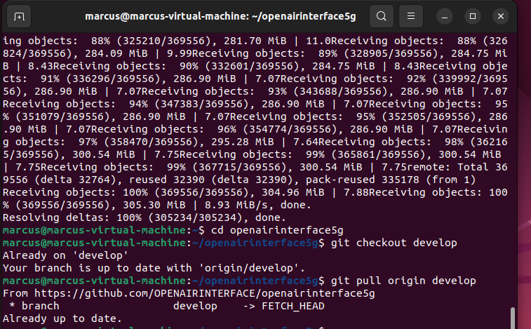
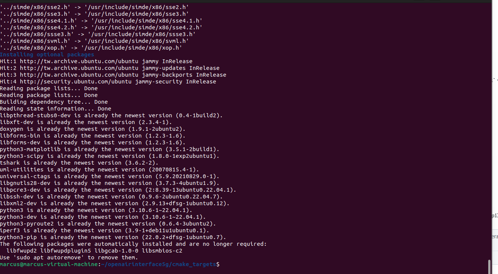
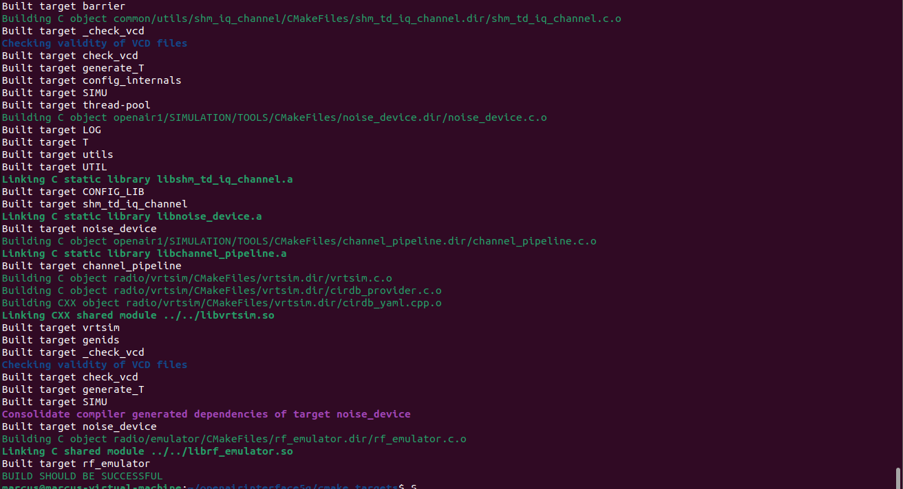
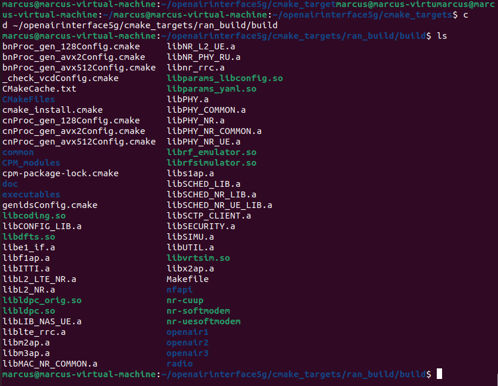
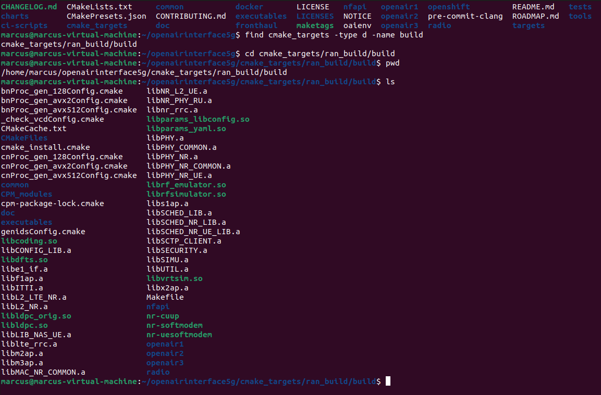
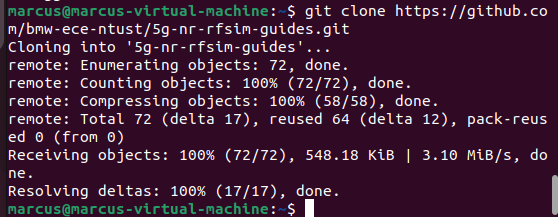
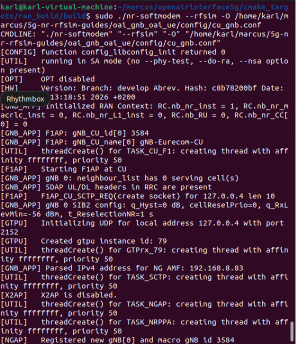
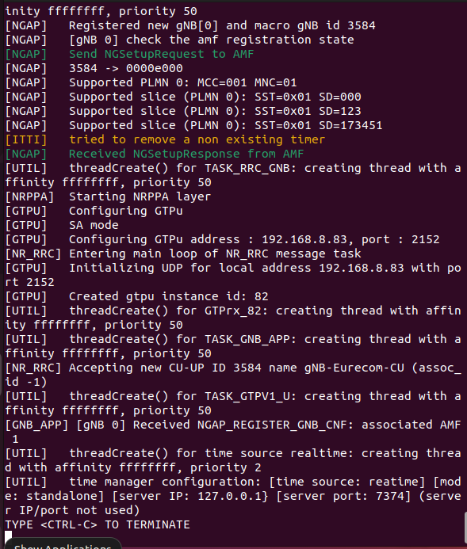
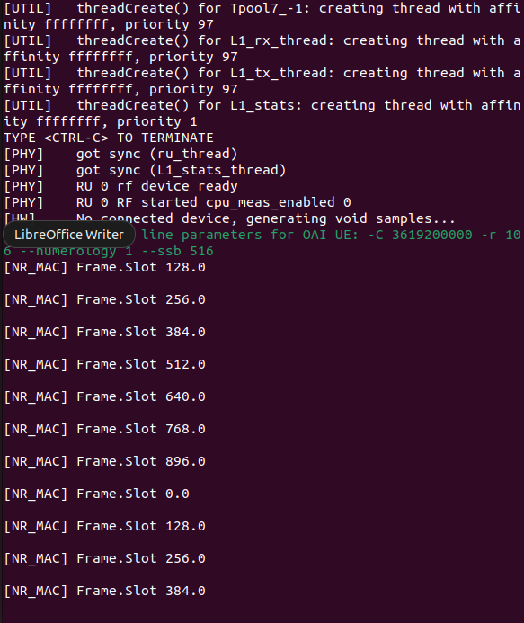
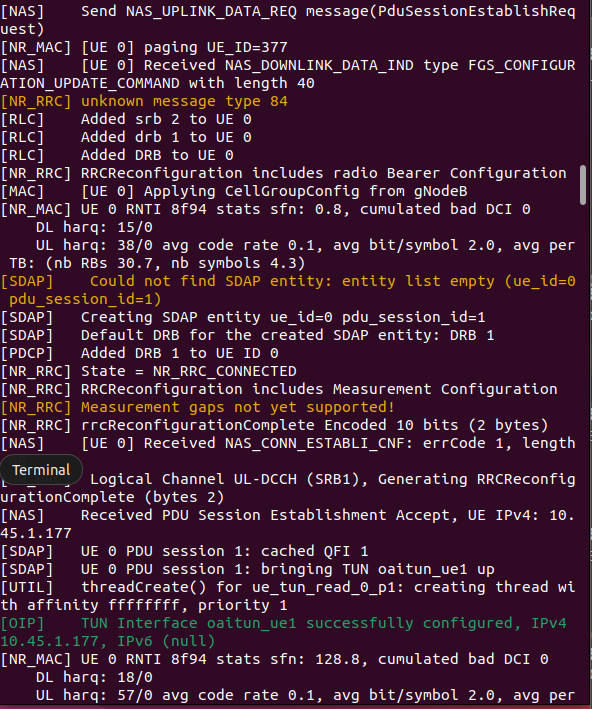

# OAI gNB (CU/DU Split) 與 OAI NR-UE RF Simulator 安裝筆記

> Author：Marcus Li  
> Last Update：2026-08  
> Tested OAI Branch：develop（建議記錄 commit SHA）  
> Ubuntu Version：22.04.5 LTS

---

# Purpose

本文件紀錄 OAI (OpenAirInterface) gNB (CU/DU Split) 與 OAI NR-UE RF Simulator 的建置流程，內容包含：

- Ubuntu VM 建立
- OAI 原始碼建置
- OAI gNB (CU/DU Split)
- OAI NR-UE
- RF Simulator
- Open5GS AMF 連線
- Troubleshooting

本文件目的不是單純紀錄操作，而是提供後續實驗室成員可重新建置相同環境的 SOP。

---

# Tested Environment

| Item | Version |
|------|---------|
| Ubuntu | 22.04.5 LTS |
| OAI Branch | develop |
| VMware | VMware Workstation |
| VPN | WireGuard |
| Architecture | OAI CU / DU Split |
| Core Network | Open5GS |

> 建議完成 clone 後紀錄目前 OAI Commit：

```bash
git rev-parse HEAD
```

方便後續使用相同版本重新建置。

---

# Repository Structure

建議工作目錄：

```text
$HOME
│
├── openairinterface5g
│
└── 5g-nr-rfsim-guides
```

若有自己的工作目錄，也可使用：

```text
$HOME
│
└── marcus
    ├── openairinterface5g
    └── 5g-nr-rfsim-guides
```

建議使用環境變數：

```bash
export WORKDIR=$HOME
export OAI_DIR=$WORKDIR/openairinterface5g
export GUIDE_DIR=$WORKDIR/5g-nr-rfsim-guides
```

後續所有指令皆可使用：

```bash
$OAI_DIR

$GUIDE_DIR
```

避免因不同使用者名稱造成路徑錯誤。

---

# Quick Start

完成整個環境建置的流程如下：

```text
Ubuntu VM
      │
      ▼
Install Git
      │
      ▼
Clone OAI
      │
      ▼
Build OAI
      │
      ▼
Clone RF Simulator Guide
      │
      ▼
Modify CU / DU / UE Config
      │
      ▼
Run CU
      │
      ▼
Run DU
      │
      ▼
Run UE
      │
      ▼
Verify
```

---

# OAI 環境建立紀錄

## 1. 確認 Ubuntu 版本

### 目的

確認 Ubuntu 版本是否符合 OAI 建議版本。

### 操作

在終端機輸入：

```bash
lsb_release -a
```

確認版本為：

```text
No LSB modules are available.
Distributor ID: Ubuntu
Description: Ubuntu 22.04.5 LTS
Release: 22.04
Codename: jammy
```

---

## 2. 更新 Ubuntu 套件

### 目的

更新 Ubuntu Repository，避免後續安裝相依套件失敗。

### 操作

```bash
sudo apt update
```

更新完成後如下圖。


---

## 3. 安裝 Git

### 目的

Git 用於下載 OpenAirInterface 原始碼。

### 操作

安裝 Git：

```bash
sudo apt install -y git
```

確認 Git 是否成功安裝：

```bash
git --version
```

結果：

```text
git version 2.34.1
```

代表 Git 已成功安裝。

---

## 4. Git Clone 與版本同步

### 目的

下載 OpenAirInterface 原始碼，並切換至指定 Branch 建立測試環境。

> **建議**
>
> OAI develop 分支更新頻繁，若要重現相同環境，建議記錄目前 Commit SHA。

---

### Step 1：Clone OAI Repository

```bash
git clone https://github.com/OPENAIRINTERFACE/openairinterface5g.git
```

---

### Step 2：進入 OAI Repository

```bash
cd openairinterface5g
```

確認目前位置：

```bash
pwd
```

例如：

```text
/home/user/openairinterface5g
```

---

### Step 3：切換至 develop Branch

```bash
git checkout develop
```

同步最新版本：

```bash
git pull origin develop
```

---

### Step 4：紀錄目前 Commit（建議）

```bash
git rev-parse HEAD
```

例如：

```text
c8b78200bfxxxxxxxxxxxxxxxxxxxxxxxx
```

建議將此 Commit 紀錄於 README，方便日後重建相同環境。

Git Clone 完成如下圖。



---

## 5. 建立 OAI 編譯環境

### 目的

建立 OAI 所需的編譯環境，並安裝所有相依套件。

---

### Step 1：進入 cmake_targets

```bash
cd cmake_targets
```

確認目前位置：

```bash
pwd
```

例如：

```text
/home/user/openairinterface5g/cmake_targets
```

---

### Step 2：載入 OAI 環境

```bash
source oaienv
```

此步驟會設定 OAI 編譯所需的環境變數。

---

### Step 3：安裝所有相依套件

執行：

```bash
./build_oai -I --install-optional-packages
```

此步驟將安裝：

- gcc
- g++
- cmake
- ASN1 Compiler
- UHD
- libsctp
- Wireshark
- 其他 OAI 所需 Library

安裝完成如下圖。



---

## 6. 編譯 gNB 與 NR-UE

### 目的

編譯 OAI gNB 與 OAI NR-UE，產生後續執行 RF Simulator 所需的執行檔。

---

### Step 1：開始編譯

```bash
./build_oai --gNB --nrUE
```

若編譯成功，最後會看到：

```text
BUILD SHOULD BE SUCCESSFUL
```

編譯完成如下圖。



---

### Step 2：確認 Build Result

進入 Build 目錄：

```bash
cd ~/openairinterface5g/cmake_targets/ran_build/build
```

確認目前位置：

```bash
pwd
```

列出所有 Binary：

```bash
ls
```

確認至少存在：

```text
nr-softmodem

nr-uesoftmodem
```

代表 gNB 與 UE 已成功完成編譯。

結果如下圖。



---

### Step 3：確認設定檔位置

返回 OAI Repository：

```bash
cd ~/openairinterface5g
```

搜尋設定檔：

```bash
find . -name "cu_gnb.conf"
find . -name "du_gnb.conf"
find . -name "ue.conf"
```

預期結果：

```text
./targets/PROJECTS/GENERIC-NR-5GC/CONF/cu_gnb.conf

./targets/PROJECTS/GENERIC-NR-5GC/CONF/du_gnb.conf

./targets/PROJECTS/GENERIC-NR-5GC/CONF/ue.conf
```

---

### Step 4：確認 Build Directory

再次回到 Build Directory：

```bash
cd ~/openairinterface5g/cmake_targets/ran_build/build
```

確認：

```bash
pwd

ls
```

確認：

- nr-softmodem
- nr-uesoftmodem

皆已產生。

結果如下圖。



---

### Build Verification Checklist

完成本章節後，應確認：

- [x] OAI Source Clone 完成
- [x] 已切換 develop Branch
- [x] OAI Environment 載入完成
- [x] Dependencies 安裝完成
- [x] gNB Build 成功
- [x] NR-UE Build 成功
- [x] `nr-softmodem` 已產生
- [x] `nr-uesoftmodem` 已產生
- [x] `cu_gnb.conf` 已確認存在
- [x] `du_gnb.conf` 已確認存在
- [x] `ue.conf` 已確認存在

若上述皆完成，即可進行下一章節（設定 CU／DU／UE Configuration）。
---

# 7. 設定檔（CU / DU / UE）

## 目的

本章節將設定 RF Simulator 所需之 **CU、DU、UE** 設定檔。

本 Repository 使用：

```text
cu_gnb.conf

du_gnb.conf

ue.conf
```

三個設定檔完成 CU、DU 及 UE 的設定。

---

## Step 1：下載設定檔 Repository

安裝 GitHub CLI（若尚未安裝）：

```bash
sudo apt update
sudo apt install gh
```

登入 GitHub：

```bash
gh auth login
```

依序選擇：

```text
GitHub.com

HTTPS

Yes

Login with a web browser
```

依照畫面完成 GitHub Authentication。

---

## Step 2：下載 RF Simulator Guide

```bash
cd ~

git clone https://github.com/bmw-ece-ntust/5g-nr-rfsim-guides.git
```

完成後確認：

```bash
ls ~/5g-nr-rfsim-guides/oai_gnb_oai_ue/config
```

應看到：

```text
cu_gnb.conf

du_gnb.conf

ue.conf
```

代表設定檔已下載完成。



---

## Step 3：確認目前 VM IP

修改設定檔之前，先確認目前 VM 的 IP。

```bash
hostname -I
```

例如：

```text
192.168.8.83
```

> **注意**
>
> 不同 VM 或不同實驗室環境的 IP 可能不同，
> 請勿直接使用他人的 IP。

---

## Step 4：修改 CU 設定檔

本實驗需要修改：

- GNB N2 IP
- GNB N3 IP

修改：

```bash
nano ~/5g-nr-rfsim-guides/oai_gnb_oai_ue/config/cu_gnb.conf
```

修改：

```conf
GNB_IPV4_ADDRESS_FOR_NG_AMF

GNB_IPV4_ADDRESS_FOR_NGU
```

修改成目前 VM IP。

例如：

```text
192.168.8.83
```

若需直接使用 sed：

```bash
sed -i 's/<OLD_IP>/<YOUR_VM_IP>/g' \
~/5g-nr-rfsim-guides/oai_gnb_oai_ue/config/cu_gnb.conf
```

---

## Step 5：確認修改成功

確認：

```bash
grep "GNB_IPV4_ADDRESS" \
~/5g-nr-rfsim-guides/oai_gnb_oai_ue/config/cu_gnb.conf

grep "amf_ip_address" \
~/5g-nr-rfsim-guides/oai_gnb_oai_ue/config/cu_gnb.conf
```

例如：

```text
GNB_IPV4_ADDRESS_FOR_NG_AMF = "192.168.8.83";

GNB_IPV4_ADDRESS_FOR_NGU = "192.168.8.83";

amf_ip_address = ({ ipv4 = "<AMF_IP>"; });
```

確認：

- GNB N2 IP 正確
- GNB N3 IP 正確
- AMF IP 正確

即可繼續。

---

## Configuration Checklist

確認：

- [x] cu_gnb.conf
- [x] du_gnb.conf
- [x] ue.conf
- [x] VM IP 已確認
- [x] GNB N2 IP 已修改
- [x] GNB N3 IP 已修改
- [x] AMF IP 已確認

---

# 8. 啟動與執行（CU / DU / UE）

## Network Topology

```text
                Open5GS
                   │
                 NG (N2)
                   │
              ┌─────────┐
              │   CU    │
              └─────────┘
                   │
                 F1AP
                   │
              ┌─────────┐
              │   DU    │
              └─────────┘
                   │
             RF Simulator
                   │
              ┌─────────┐
              │   UE    │
              └─────────┘
```

---

## Step 1：開啟三個 Terminal

分別用於：

```text
Terminal 1

↓

CU
```

```text
Terminal 2

↓

DU
```

```text
Terminal 3

↓

UE
```

每個 Terminal 皆先進入：

```bash
cd ~/openairinterface5g/cmake_targets/ran_build/build
```

---

# Terminal 1：啟動 CU

執行：

```bash
sudo ./nr-softmodem \
--rfsim \
-O ~/5g-nr-rfsim-guides/oai_gnb_oai_ue/config/cu_gnb.conf
```

若成功，Log 應包含：

```text
Received NGSetupResponse from AMF

Received F1 Setup Request

Accepting DU
```

代表：

- CU 成功啟動
- 成功連線 Open5GS
- 成功接受 DU

如下圖。





---

# Terminal 2：啟動 DU

執行：

```bash
sudo ./nr-softmodem \
--rfsim \
-O ~/5g-nr-rfsim-guides/oai_gnb_oai_ue/config/du_gnb.conf
```

若成功：

```text
Received F1 Setup Response

CBRA procedure succeeded
```

代表：

- DU 成功連線 CU
- UE 成功完成 Random Access

如下圖。



---

# Terminal 3：啟動 UE

執行：

```bash
sudo ./nr-uesoftmodem \
-r 106 \
--numerology 1 \
--band 78 \
-C 3619200000 \
--rfsim \
-O ~/5g-nr-rfsim-guides/oai_gnb_oai_ue/config/ue.conf
```

若成功：

```text
Initial sync successful

SIB1 decoded

State = NR_RRC_CONNECTED

Received Registration Accept

Received PDU Session Establishment Accept
```

如下圖。



---
---

# 9. 驗證結果（Verification）

完成 CU、DU、UE 啟動後，可依照下列項目確認整個 OAI RF Simulator 環境是否正常運作。

## CU 驗證

若 CU 啟動成功，Log 應包含：

```text
Received NGSetupResponse from AMF

Received F1 Setup Request

Accepting DU
```

代表：

- CU 已成功啟動
- 已成功與 Open5GS AMF 建立 NG Interface
- 已成功建立 F1 Interface

---

## DU 驗證

若 DU 啟動成功，Log 應包含：

```text
Received F1 Setup Response

CBRA procedure succeeded
```

代表：

- DU 已成功連線至 CU
- UE 已完成 Random Access

---

## UE 驗證

若 UE 啟動成功，Log 應包含：

```text
Initial sync successful

SIB1 decoded

State = NR_RRC_CONNECTED

Received Registration Accept

Received PDU Session Establishment Accept

UE IPv4: 10.45.x.x

TUN interface oaitun_ue1 successfully configured
```

代表：

- UE 已成功同步
- UE 已完成 Registration
- UE 已建立 PDU Session
- Open5GS 已成功分配 IP
- Tunnel 已建立

---

## Verification Checklist

完成後應確認：

- [x] CU connected to AMF
- [x] DU connected to CU (F1 Setup)
- [x] UE completed Random Access
- [x] UE reached NR_RRC_CONNECTED
- [x] NAS Registration succeeded
- [x] PDU Session established
- [x] UE obtained IPv4 address
- [x] oaitun_ue1 created successfully

若以上皆完成，即代表整個 OAI RF Simulator 環境建置成功。

---

# 99. Troubleshooting

## 99.1 Ubuntu VM 無法連線至 GitHub

### Error

```text
fatal: unable to access 'https://github.com/...'

Could not resolve host

Temporary failure in name resolution
```

### Possible Cause

- VM Network 未啟用
- VMware Network Adapter 設定異常
- DNS 無法解析

### Solution

回到 VMware：

```
Edit
    ↓
Virtual Network Editor
    ↓
Restore Defaults
```

重新啟動 VM。

重新確認：

```bash
ping github.com
```

若成功即可重新 Clone Repository。

---

## 99.2 CU 啟動失敗

### Error

```text
[GTPU] bind: Cannot assign requested address

[E1AP] Failed to create CUUP N3 UDP listener
```

### Possible Cause

目前 VM IP 與設定檔 IP 不一致。

例如：

目前 VM：

```text
192.168.8.83
```

但：

```conf
GNB_IPV4_ADDRESS_FOR_NG_AMF
```

仍設定為：

```text
192.168.8.44
```

---

### Solution

確認目前 VM IP：

```bash
hostname -I
```

修改：

```bash
nano ~/5g-nr-rfsim-guides/oai_gnb_oai_ue/config/cu_gnb.conf
```

更新：

```conf
GNB_IPV4_ADDRESS_FOR_NG_AMF

GNB_IPV4_ADDRESS_FOR_NGU
```

重新啟動 CU。

---

## 99.3 無法連線至實驗室 VM

### Possible Cause

尚未連接實驗室 VPN。

### Solution

使用 WireGuard 建立 VPN。

確認狀態：

```text
Status : Connected
```

接著：

```bash
ssh <lab-user>@<lab-vm-ip>
```

若可登入，即代表 VPN 已正常建立。

---

## 99.4 找不到 OAI Repository

### Error

```text
No such file or directory
```

### Solution

確認目前位置：

```bash
pwd
```

或：

```bash
find $HOME -name openairinterface5g
```

確認 Repository 是否存在。

---

## 99.5 Build Failed

若 Build 中斷，可重新執行：

```bash
cd ~/openairinterface5g/cmake_targets

./build_oai --gNB --nrUE
```

若修改過 Source Code，建議重新編譯。

---

## 99.6 無法建立 PDU Session

請確認：

- Open5GS 是否正常運作
- AMF IP 是否正確
- UE Config 是否正確
- CU Config 是否正確
- DU Config 是否正確

---

# Security Notes

本 Repository 不建議保存：

- Lab VPN Configuration
- WireGuard Private Key
- SSH Password
- IMSI（正式環境）
- OPc（正式環境）
- Subscriber Key（正式環境）

若需分享 Repository，建議：

- 使用 Template Config
- 將 IP 改為 Placeholder
- 不提交任何 Private Key

例如：

```text
<AMF_IP>

<GNB_IP>

<LAB_USER>
```

---

# References

OpenAirInterface Documentation

https://openairinterface.org/

OpenAirInterface GitHub

https://github.com/OPENAIRINTERFACE/openairinterface5g

OAI Build Guide

https://openairinterface-docs-5b3d70.eurecom.io/projects/OpenAirInterface5G/BUILD/

OAI Run Guide

https://github.com/OPENAIRINTERFACE/openairinterface5g/blob/develop/doc/RUNMODEM.md

Open5GS

https://open5gs.org/

---

# Revision History

| Version | Date | Description |
|----------|------|-------------|
| 1.0 | 2026-08 | Initial installation notes |
| 1.1 | 2026-08 | Added verification, troubleshooting, security notes and documentation improvements |
