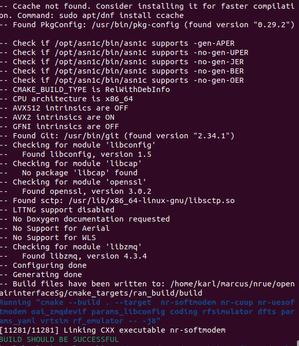
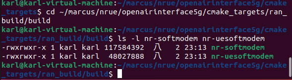
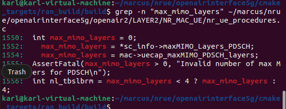
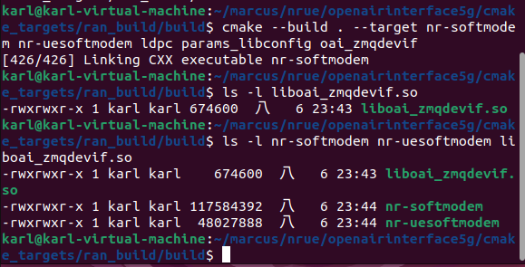
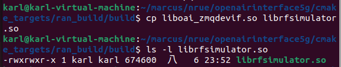
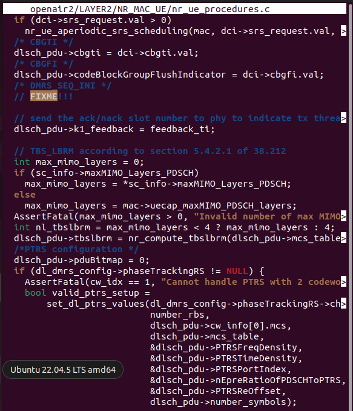
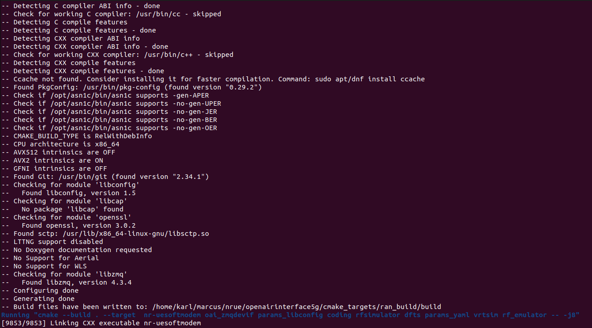
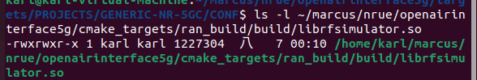
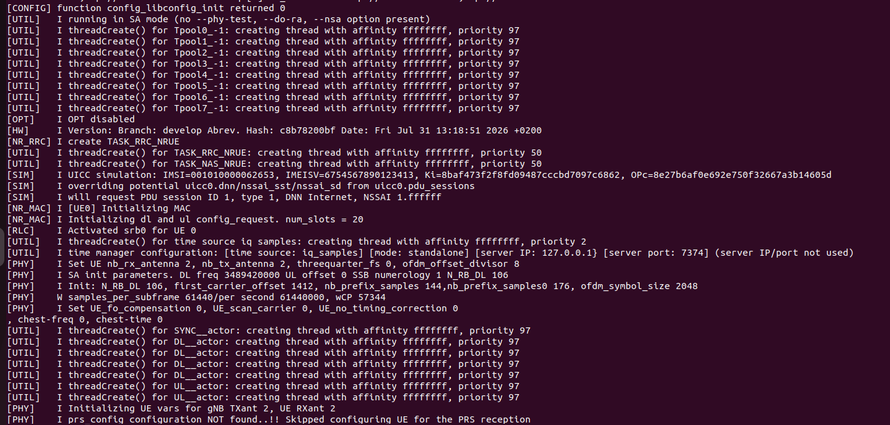
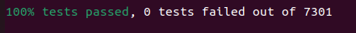

# OAI NR-UE 建置與驗證筆記

詳細記錄我在建立此 OAI 的各項步驟以及使用的程式。

## 前置條件

**1.** 建立一個新的資料夾：
```bash
mkdir -p ~/marcus/nrue
cd ~/marcus/nrue
pwd
```

**2.** 安裝必要系統套件：
```bash
sudo apt-get update
sudo apt-get install libzmq3-dev libczmq-dev
```

---

## NRUE 安裝筆記

### 1. 複製儲存庫
```bash
git clone https://github.com/OPENAIRINTERFACE/openairinterface5g.git
cd openairinterface5g
```

---

### 2. 切換至 `develop` 分支
```bash
git checkout develop
git pull origin develop
```

---

### 3. 載入 oai 環境：
```bash
source oaienv
cd cmake_targets
./build_oai -I --gNB --nrUE --ninja -w ZMQ
```


輸入以下的程式，確認 `nr-uesoftmodem` 也有產生：
```bash
cd ~/marcus/nrue/openairinterface5g/cmake_targets/ran_build/build
ls -l nr-softmodem nr-uesoftmodem
```


確認版本 `grep -n "max_mimo_layers" ~/marcus/nrue/openairinterface5g/openair2/LAYER2/NR_MAC_UE/nr_ue_procedures.c` ：


---

### 4. 建置特定目標
執行：
```bash
cd openairinterface5g/cmake_targets/ran_build/build

cmake --build . --target nr-softmodem nr-uesoftmodem ldpc params_libconfig oai_zmqdevif
```
結果應該是長這樣：
```bash
cmake --build . --target nr-softmodem nr-uesoftmodem ldpc params_libconfig oai_zmqdevif
[426/426] Linking CXX executable nr-softmodem
```
這一步的目的，是確認這幾個目標都有成功建出來，尤其是：
```bash
nr-softmodem
nr-uesoftmodem
liboai_zmqdevif.so
```

建置成功後，建立 RF 模擬器函式庫的符號連結：
執行：
```bash
cp liboai_zmqdevif.so librfsimulator.so

ls -l librfsimulator.so
```
如果能看到 `librfsimulator.so`，就可以進到下一步：修改 `max_mimo_layers`。 

---

### 5. 原始碼修補
修改 `max_mimo_layers` ，回到專案根目錄： `cd ~/marcus/nrue/openairinterface5g` ，並執行 `nano openair2/LAYER2/NR_MAC_UE/nr_ue_procedures.c` 。<br>
搜尋：
```bash
AssertFatal(max_mimo_layers
```


修補以下程式：
```bash
int max_mimo_layers = 0;
if (sc_info->maxMIMO_Layers_PDSCH)
  max_mimo_layers = *sc_info->maxMIMO_Layers_PDSCH;
else
  max_mimo_layers = mac->uecap_maxMIMO_PDSCH_layers;

AssertFatal(max_mimo_layers > 0,
            "Invalid number of max MIMO layers for PDSCH\n");
```
在 `AssertFatal(max_mimo_layers` 之前加入程式：
```bash
if (max_mimo_layers == 0) {
  max_mimo_layers = 2;
}
```
儲存後，重新建置：
```bash
cd openairinterface5g/cmake_targets
./build_oai --nrUE --ninja -w ZMQ -c
```

接下來先確認執行檔與 `ZMQ library` 都還在：
```bash
-rwxrwxr-x 1 karl karl   674600  八   7 00:10 liboai_zmqdevif.so
-rwxrwxr-x 1 karl karl  1227304  八   7 00:10 librfsimulator.so
-rwxrwxr-x 1 karl karl 48028328  八   7 00:11 nr-uesoftmodem
```

---

### 6. UE 設定
執行 `find ~/marcus/nrue/openairinterface5g -name "oai_ue.conf" -o -name "ue.conf"` ，尋找路徑： `openairinterface5g/targets/PROJECTS/GENERIC-NR-5GC/CONF/johnson/oai_ue.conf`。<br> [查詢結果](../Images/nrue_setup_8.png)

修改 `imsi` 、 `key` 、 `opc` 、 `dnn` 、 `nssai_sst`，以下為修改前數值：
```bash
uicc0 = {
imsi = "2089900007487";
key = "fec86ba6eb707ed08905757b1bb44b8f";
opc= "C42449363BBAD02B66D16BC975D77CC1";
pdu_sessions = ({ dnn = "oai"; nssai_sst = 1; });
}

position0 = {
    x = 0.0;
    y = 0.0;
    z = 6377900.0;
}
```
以下為修改的正確數值(請務必修改成此數值)：
```bash
uicc0 = {
imsi = "001010000062653";
key = "8baf473f2f8fd09487cccbd7097c6862";
opc= "8e27b6af0e692e750f32667a3b14605d";
pdu_sessions = ({ dnn = "Internet"; nssai_sst = 1; });
}

position0 = {
    x = 0.0;
    y = 0.0;
    z = 6377900.0;
}
```
並確認執行 `ls -l ~/marcus/nrue/openairinterface5g/cmake_targets/ran_build/build/librfsimulator.so` 確認檔案是否存在。 

---

### 7. 啟動 NR-UE
輸入目錄 `cd ~/marcus/nrue/openairinterface5g/cmake_targets/ran_build/build` ，並執行以下程式：
```bash
sudo ./nr-uesoftmodem \
-r 106 \
--numerology 1 \
--band 78 \
-C 3489420000 \
--ssb 42 \
--rfsim \
-O ../../../targets/PROJECTS/GENERIC-NR-5GC/CONF/marcus/oai_ue.conf \
--ue-nb-ant-tx 2 \
--ue-nb-ant-rx 2 \
--log_config.global_log_options level,nocolor \
--device.name oai_zmqdevif \
--zmq.[0].tx_channels "tcp://127.0.0.1:4556,tcp://127.0.0.1:4557" \
--zmq.[0].rx_channels "tcp://127.0.0.1:4558,tcp://127.0.0.1:4559"
```
若成功啟動則會看到以下成果：
```bash
[CONFIG] function config_libconfig_init returned 0
[SIM] UICC simulation...
[HW] [RAU] has loaded RFSIMULATOR device.
[HW] [ZMQ] TX socket ...
[HW] [ZMQ] RX socket ...
```


---

## gNB 安裝筆記

### 1. 複製儲存庫
執行：
```bash
git clone https://gitlab.com/ocudu/ocudu.git
cd ocudu
```

### 2. 建置
執行：
```bash
mkdir build
cd build
cmake ../
make -j 8
```

### 3. 測試
執行 `make test -j $(nproc)` 測試剛剛是否有建立成功，成功執行後，應顯示 100% tests passed，共通過全部 7301 個測試案例。 


### 4. 安裝 gNB 執行檔
執行以下程式安裝執行檔：
```bash
cd apps/gnb
sudo make install
```


### 5. 確認是否有 `test.yaml`
執行 `find ~ -name "test.yaml"` 。若無的話可以參考 `99. Troubleshooting - 3`，了解如何建立。


### 6.啟動 gNB
執行 `sudo ./gnb -c test.yaml`，期待看到以下結果：
```bash
--== OCUDU gNB (commit 91552ede58) ==--

Lower PHY in executor sequential baseband mode.
Available radio types: uhd, zmq and realtime_loopback.
Cell pci=1, bw=40 MHz, 2T2R, dl_arfcn=632628 (n78), dl_freq=3489.42 MHz, ...

N2: Connection to AMF on 192.168.8.108:38412 completed
==== gNB started ===
Type <h> to view help
```


## 99. Troubleshooting

### 1. 找不到 `uecap.xml`

**遇到的問題**

執行：

```bash
ls -l /opt/oai-nr-ue/etc/uecap.xml
```

出現：

```bash
ls: cannot access '/opt/oai-nr-ue/etc/uecap.xml': No such file or directory
```

**可能原因**

目前使用 Source Build 建立 OAI，系統中沒有 `/opt/oai-nr-ue/etc/` 目錄，因此不存在 `uecap.xml`。

**解決方法**

將啟動指令中的：

```bash
--uecap_file /opt/oai-nr-ue/etc/uecap.xml
```

移除即可。

**結果**

NR-UE 可以正常啟動，並成功載入 ZMQ RF Simulator。

---

### 2. `cannot open include file`

**遇到的問題**

第一次啟動 NR-UE 時出現：

```bash
file .../marcus/oai_ue.conf - line 16: cannot open include file

config module "libconfig" couldn't be loaded

Segmentation fault
```

**可能原因**

將 `ue.conf` 複製至 `CONF/marcus/` 後，`@include` 使用原本的相對路徑，導致找不到引用檔案。

**解決方法**

將：

```bash
@include "channelmod_rfsimu_LEO_satellite.conf"
```

修改為：

```bash
@include "../channelmod_rfsimu_LEO_satellite.conf"
```

**結果**

設定檔成功載入，NR-UE 可正常啟動。


