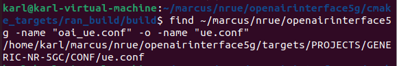
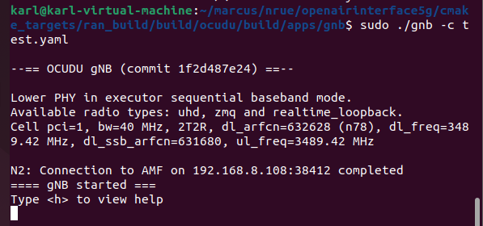

# OAI NR-UE (ZMQ) and OCUDU gNB Deployment Guide

This document provides a complete guide for building, configuring, verifying, and troubleshooting OAI NR-UE (ZMQ RF Simulator) together with the OCUDU gNB. It is intended to serve as a reference for future research projects and laboratory handovers.

---

# Tested Environment

| Item | Version |
|------|---------|
| Ubuntu | 22.04.5 LTS |
| OAI Branch | develop |
| Radio Interface | ZMQ RF Simulator |
| gNB | OCUDU |
| Core Network | Open5GS |

---

# Prerequisites

### 1. Create a New Workspace

```bash
mkdir -p ~/marcus/nrue
cd ~/marcus/nrue
pwd
```

### 2. Install Required Packages

```bash
sudo apt-get update
sudo apt-get install libzmq3-dev libczmq-dev
```

---

# OAI NR-UE Installation Guide

## 1. Clone the Repository

```bash
git clone https://github.com/OPENAIRINTERFACE/openairinterface5g.git
cd openairinterface5g
```

---

## 2. Switch to the `develop` Branch

```bash
git checkout develop
git pull origin develop
```

---

## 3. Prepare the OAI Build Environment

Load the OAI environment and install all required dependencies.

```bash
source oaienv
cd cmake_targets
./build_oai -I --gNB --nrUE --ninja -w ZMQ
```


After the build process is complete, verify that both `nr-softmodem` and `nr-uesoftmodem` have been generated successfully.

```bash
cd ~/marcus/nrue/openairinterface5g/cmake_targets/ran_build/build
ls -l nr-softmodem nr-uesoftmodem
```


Locate the implementation of `max_mimo_layers` in the current source code.

```bash
grep -n "max_mimo_layers" \
~/marcus/nrue/openairinterface5g/openair2/LAYER2/NR_MAC_UE/nr_ue_procedures.c
```


---

## 4. Build Required Targets

Navigate to the build directory:

```bash
cd ~/marcus/nrue/openairinterface5g/cmake_targets/ran_build/build
```

Run the following command:

```bash
cmake --build . --target nr-softmodem nr-uesoftmodem ldpc params_libconfig oai_zmqdevif
```

After the build completes successfully, the output should be similar to:

```text
[426/426] Linking CXX executable nr-softmodem
```

This step rebuilds the main OAI executables together with the ZMQ RF Simulator library to ensure all required binaries for NR-UE have been generated successfully.

Verify that the following files are present:

```text
nr-softmodem
nr-uesoftmodem
liboai_zmqdevif.so
```


Next, create a symbolic copy of the RF Simulator library:

```bash
cp liboai_zmqdevif.so librfsimulator.so
```

Verify that the library exists:

```bash
ls -l librfsimulator.so
```

If `librfsimulator.so` is present, proceed to the next step.


---

## 5. Apply the Source Code Patch

To avoid an assertion failure when `max_mimo_layers` is equal to `0`, a small modification to the NR-UE source code is required.

Return to the project root directory:

```bash
cd ~/marcus/nrue/openairinterface5g
```

Open the source file:

```bash
nano openair2/LAYER2/NR_MAC_UE/nr_ue_procedures.c
```

Search for:

```text
AssertFatal(max_mimo_layers
```


Locate the following code:

```c
int max_mimo_layers = 0;
if (sc_info->maxMIMO_Layers_PDSCH)
  max_mimo_layers = *sc_info->maxMIMO_Layers_PDSCH;
else
  max_mimo_layers = mac->uecap_maxMIMO_PDSCH_layers;

AssertFatal(max_mimo_layers > 0,
            "Invalid number of max MIMO layers for PDSCH\n");
```

Insert the following code **before** `AssertFatal(...)`:

```c
if (max_mimo_layers == 0) {
    max_mimo_layers = 2;
}
```

After applying the patch, the code should look similar to:

```c
int max_mimo_layers = 0;
if (sc_info->maxMIMO_Layers_PDSCH)
  max_mimo_layers = *sc_info->maxMIMO_Layers_PDSCH;
else
  max_mimo_layers = mac->uecap_maxMIMO_PDSCH_layers;

if (max_mimo_layers == 0) {
    max_mimo_layers = 2;
}

AssertFatal(max_mimo_layers > 0,
            "Invalid number of max MIMO layers for PDSCH\n");
```

Save the file and rebuild NR-UE:

```bash
cd ~/marcus/nrue/openairinterface5g/cmake_targets
./build_oai --nrUE --ninja -w ZMQ -c
```


After rebuilding, verify that the executable files and ZMQ library are still available:

```bash
cd ~/marcus/nrue/openairinterface5g/cmake_targets/ran_build/build

ls -l liboai_zmqdevif.so librfsimulator.so nr-uesoftmodem
```

A successful result should include files similar to:

```text
liboai_zmqdevif.so
librfsimulator.so
nr-uesoftmodem
```

---

## 6. Configure NR-UE

First, locate the available UE configuration file within the repository:

```bash
find ~/marcus/nrue/openairinterface5g \
-name "oai_ue.conf" -o -name "ue.conf"
```



If a personal configuration file does not already exist, create one by copying the default configuration:

```bash
cd ~/marcus/nrue/openairinterface5g/targets/PROJECTS/GENERIC-NR-5GC/CONF

mkdir -p marcus

cp ue.conf marcus/oai_ue.conf
```

The configuration file should be located at:

```text
openairinterface5g/targets/PROJECTS/GENERIC-NR-5GC/CONF/marcus/oai_ue.conf
```

Modify the following parameters:

- `imsi`
- `key`
- `opc`
- `dnn`
- `nssai_sst`

The default configuration may look similar to:

```conf
uicc0 = {
  imsi = "<ORIGINAL_IMSI>";
  key = "<ORIGINAL_KEY>";
  opc = "<ORIGINAL_OPC>";
  pdu_sessions = ({
    dnn = "oai";
    nssai_sst = 1;
  });
}

position0 = {
    x = 0.0;
    y = 0.0;
    z = 6377900.0;
}
```

Update the configuration so that it matches the subscriber information stored in the Open5GS database.

Example:

```conf
uicc0 = {
  imsi = "<TEST_IMSI>";
  key = "<TEST_KEY>";
  opc = "<TEST_OPC>";
  pdu_sessions = ({
    dnn = "Internet";
    nssai_sst = 1;
  });
}

position0 = {
    x = 0.0;
    y = 0.0;
    z = 6377900.0;
}
```

> **Note**
>
> For public GitHub repositories, it is recommended to replace the IMSI, Key, and OPc values with placeholders instead of exposing actual subscriber credentials.

Finally, verify that the RF Simulator library exists:

```bash
ls -l ~/marcus/nrue/openairinterface5g/cmake_targets/ran_build/build/librfsimulator.so
```


---

## 7. Run NR-UE

After startup, the ZMQ driver will be initialized and the NR-UE will wait for the OCUDU gNB to establish a connection.

Navigate to the build directory:

```bash
cd ~/marcus/nrue/openairinterface5g/cmake_targets/ran_build/build
```

Run the following command:

```bash
sudo ./nr-uesoftmodem \
-r 106 \
--numerology 1 \
--band 78 \
-C 3489420000 \
--ssb 42 \
--rfsim \
-O ../../../targets/PROJECTS/GENERIC-NR-5GC/CONF/marcus/oai_ue.conf \
--ue-nb-ant-tx 2 \
--ue-nb-ant-rx 2 \
--log_config.global_log_options level,nocolor \
--device.name oai_zmqdevif \
--zmq.[0].tx_channels "tcp://127.0.0.1:4556,tcp://127.0.0.1:4557" \
--zmq.[0].rx_channels "tcp://127.0.0.1:4558,tcp://127.0.0.1:4559"
```

If the initialization is successful, output similar to the following should appear:

```text
[CONFIG] function config_libconfig_init returned 0
[SIM] UICC simulation...
[HW] [RAU] has loaded RFSIMULATOR device.
[HW] [ZMQ] TX socket ...
[HW] [ZMQ] RX socket ...
```


> **Note**
>
> If the OCUDU gNB has not been started, the NR-UE will remain in the synchronization stage while waiting for the gNB signal.

---

# OCUDU gNB Installation Guide

## 1. Clone the Repository

Clone the OCUDU repository and enter the project directory:

```bash
git clone https://gitlab.com/ocudu/ocudu.git
cd ocudu
```

---

## 2. Build the OCUDU Project

Create a build directory:

```bash
mkdir build
cd build
```

Generate the build files using CMake:

```bash
cmake ../
```

Compile the project:

```bash
make -j 8
```

> **Tip**
>
> The number following `-j` specifies the number of parallel build jobs.
> You may increase or decrease this value depending on the number of CPU cores available on your system.

---

## 3. Run Unit Tests

After the build has completed successfully, run the unit tests to verify that the project was compiled correctly.

```bash
make test -j $(nproc)
```

If all tests pass successfully, the output should be similar to:

```text
100% tests passed
```

This indicates that all unit tests have completed successfully.


---

## 4. Install the gNB Executable

Navigate to the gNB application directory:

```bash
cd apps/gnb
```

Install the executable:

```bash
sudo make install
```

After installation, verify that the executable has been installed correctly:

```bash
which gnb
```

The expected output is:

```text
/usr/local/bin/gnb
```

This confirms that the OCUDU gNB executable has been installed successfully.

---

## 5. Prepare the `test.yaml` Configuration File

First, check whether a `test.yaml` configuration file already exists:

```bash
find ~ -name "test.yaml"
```

If no configuration file is found, create one manually:

```bash
nano test.yaml
```

The configuration file should contain at least the following settings:

- AMF IP Address
- gNB Bind Address
- PLMN
- TAC
- NR Band
- Downlink ARFCN
- Channel Bandwidth
- ZMQ TX/RX Ports
- Antenna Configuration

A simplified example is shown below:

```yaml
cu_cp:
  amf:
    addr: <AMF_IP>
    port: 38412
    bind_addr: <GNB_BIND_IP>

ru_sdr:
  device_driver: zmq
  device_args: tx_port=tcp://127.0.0.1:4558,tx_port=tcp://127.0.0.1:4559,rx_port=tcp://127.0.0.1:4556,rx_port=tcp://127.0.0.1:4557

cell_cfg:
  dl_arfcn: 632628
  band: 78
  channel_bandwidth_MHz: 40
  common_scs: 30
  plmn: "00101"
  tac: 1
  pci: 1

log:
  filename: gnb.log
  all_level: debug
```

> **Note**
>
> Replace `<AMF_IP>` and `<GNB_BIND_IP>` with the corresponding IP addresses in your own network environment.

---

## 6. Launch OCUDU gNB

Navigate to the directory containing the `test.yaml` configuration file.

```bash
cd ~/ocudu/build/apps/gnb
```

Launch the gNB using:

```bash
sudo ./gnb -c test.yaml
```

If the startup is successful, output similar to the following should appear:

```text
--== OCUDU gNB (commit xxxxxxxxxx) ==--

Lower PHY in executor sequential baseband mode.

Available radio types: uhd, zmq and realtime_loopback.

Cell pci=1, bw=40 MHz, 2T2R, dl_arfcn=632628 (n78), dl_freq=3489.42 MHz

N2: Connection to AMF on <AMF_IP>:38412 completed

==== gNB started ====

Type <h> to view help
```



When the following message appears:

```text
N2: Connection to AMF on <AMF_IP>:38412 completed
```

it indicates that the gNB has successfully established an N2 connection with the Open5GS AMF.

When the following message appears:

```text
==== gNB started ====
```

the OCUDU gNB has been initialized successfully and is ready to accept UE connections.

---

# Network Topology

```
            Open5GS
               │
            N2 Interface
               │
         +-------------+
         | OCUDU gNB   |
         +-------------+
               │
        ZMQ RF Simulator
               │
         +-------------+
         | OAI NR-UE   |
         +-------------+
               │
        TUN Interface
               │
        10.45.x.x
```

# Verification Checklist

Verify that all of the following items have been completed successfully.

| Item | Status |
|------|:------:|
| OCUDU gNB Started | ✅ |
| N2 Connected to AMF | ✅ |
| ZMQ RF Simulator Loaded | ✅ |
| Initial Synchronization Successful | ✅ |
| SIB1 Successfully Decoded | ✅ |
| Random Access Procedure Completed | ✅ |
| RRC Connection Established | ✅ |
| Registration Accept Received | ✅ |
| PDU Session Established | ✅ |
| UE IPv4 Address Assigned | ✅ |
| TUN Interface (`oaitun_ue1`) Created | ✅ |

Once all items above have been verified, the end-to-end connection between the OCUDU gNB, OAI NR-UE, and Open5GS Core Network has been successfully established.

---

# Successful Result

When the end-to-end connection has been established successfully, the UE log should contain messages similar to the following:

```text
Initial sync successful

SIB1 decoded

4-Step RA procedure succeeded

[NR_RRC] State = NR_RRC_CONNECTED

[NAS] Received Registration Accept with result 3GPP

[NAS] Received PDU Session Establishment Accept

UE IPv4: 10.45.x.x

[OIP] TUN Interface oaitun_ue1 successfully configured
```

The messages above indicate that:

- The UE has successfully synchronized with the gNB.
- System Information Block 1 (SIB1) has been decoded successfully.
- The Random Access Procedure has completed successfully.
- The UE has entered the **NR_RRC_CONNECTED** state.
- NAS Registration with the Open5GS Core has completed successfully.
- A PDU Session has been established successfully.
- An IPv4 address has been assigned by Open5GS.
- The virtual TUN interface (`oaitun_ue1`) has been created successfully.

It is recommended to save the successful log files for future comparison during debugging or configuration changes.

Example:

```text
log/
├── ue.log
└── gnb.log
```

- **ue.log** records the UE startup process, RRC procedures, NAS registration, and PDU session establishment.
- **gnb.log** records the gNB startup process, N2 connection establishment, and UE access procedures.

---

# Troubleshooting

## 1. `uecap.xml` Not Found

### Problem

Running the following command:

```bash
ls -l /opt/oai-nr-ue/etc/uecap.xml
```

returns:

```text
ls: cannot access '/opt/oai-nr-ue/etc/uecap.xml': No such file or directory
```

### Cause

The current OAI environment was built directly from the source code instead of using the official installation package. Therefore, the directory `/opt/oai-nr-ue/etc/` does not exist, and the `uecap.xml` file is not provided.

### Solution

Remove the following option from the NR-UE startup command:

```bash
--uecap_file /opt/oai-nr-ue/etc/uecap.xml
```

### Result

The NR-UE starts normally and successfully loads the ZMQ RF Simulator.

---

## 2. `cannot open include file`

### Problem

The following error appears when launching NR-UE:

```text
file .../marcus/oai_ue.conf - line 16: cannot open include file

config module "libconfig" couldn't be loaded

Segmentation fault
```

### Cause

After copying `ue.conf` into `CONF/marcus/`, the `@include` statement still references the original relative path. As a result, the configuration file cannot locate the included file.

### Solution

Replace:

```conf
@include "channelmod_rfsimu_LEO_satellite.conf"
```

with:

```conf
@include "../channelmod_rfsimu_LEO_satellite.conf"
```

### Result

The configuration file loads successfully, and NR-UE starts without errors.

---

## 3. `test.yaml` Not Found

### Problem

Running:

```bash
find ~ -name "test.yaml"
```

returns no results.

### Cause

The current OCUDU repository does not include a default `test.yaml` configuration file for this environment.

### Solution

Create a new configuration file manually:

```bash
nano test.yaml
```

At a minimum, verify that the following parameters are configured correctly:

- AMF IP Address
- gNB Bind Address
- PLMN
- TAC
- NR Band
- Downlink ARFCN
- Channel Bandwidth
- ZMQ TX Ports
- ZMQ RX Ports
- Antenna Configuration

After saving the configuration, launch the gNB:

```bash
sudo ./gnb -c test.yaml
```

### Result

If the configuration is correct, output similar to the following should appear:

```text
N2: Connection to AMF on <AMF_IP>:38412 completed

==== gNB started ====
```

This indicates that the gNB has successfully connected to the AMF and is ready to accept UE connections.

---

# References

- OpenAirInterface 5G Repository  
  https://github.com/OPENAIRINTERFACE/openairinterface5g

- OCUDU Documentation  
  https://docs.ocudu.org/user_manual/installation/

- Open5GS Documentation  
  https://open5gs.org/
- 3GPP TS 38.211
- 3GPP TS 38.212
- 3GPP TS 38.214
---

# License

This document is intended for educational and research purposes.

Feel free to modify or extend the content according to your own experimental environment.
